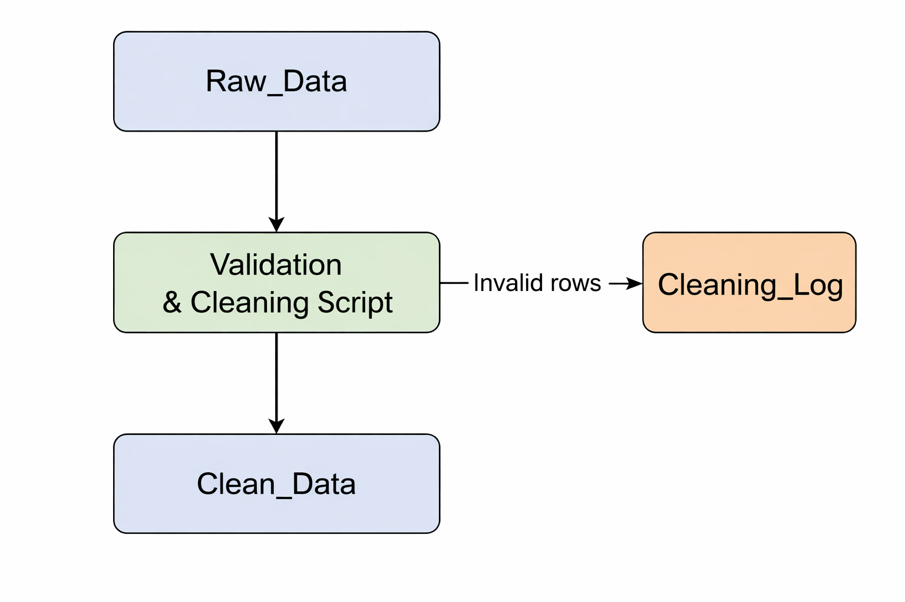

# Google Sheets Data Cleaning Automation (Apps Script)

This project demonstrates how to clean, validate and audit spreadsheet data using **Google Apps Script**.

It reads raw data from a Google Sheet, applies validation and cleaning rules, and exports valid records into a clean dataset while keeping an **audit trail of discarded rows**.

This type of automation is commonly used in **data migration, data preparation and spreadsheet workflow automation**.

---

## Features

- Data validation and cleaning
- Removal of incomplete records
- Automatic conversion of text-based numeric values
- Sales threshold filtering
- Logging of skipped rows
- Audit trail stored in `Cleaning_Log`
- UI confirmation popup
- Custom menu inside Google Sheets

---

## Tech Stack

- Google Apps Script
- JavaScript (ES6)
- Google Sheets

---

## Example Workflow

The script reads raw records from the `Raw_Data` sheet, validates and cleans the data, and writes the valid rows into `Clean_Data`.  
Invalid or incomplete rows are logged into the `Cleaning_Log` sheet to keep an audit trail of discarded data.

---

## Input Format (Raw_Data)

Expected columns:

| Column | Description |
|------|-------------|
| Name | Customer or user name |
| Email | Contact email |
| Sales | Numeric sales value |

Example messy data the script can handle:

| Name | Email | Sales |
|-----|------|------|
| Mario | mario@email.com | 150 |
| Luca |  | 200 |
| Anna | anna@email.com | 80 |
| John | john@email.com | "150€" |

---

## Cleaning Rules

The script performs the following validations:

1. Removes rows where **Name or Email is missing**
2. Cleans numeric values from text (example: `"150€"` → `150`)
3. Converts values to numbers
4. Keeps only rows where **Sales ≥ 100**
5. Logs discarded rows into the **Cleaning_Log** sheet

---

## How to Use

1. Create a Google Sheet with the following tabs:

Raw_Data  
Clean_Data

2. Open **Extensions → Apps Script**

3. Copy the script from:

src/cleaning.js

4. Save the project

5. Run `runCleaning()` once to authorize the script

6. Reload the spreadsheet

You will see a custom menu:

Data Tools → Run Data Cleaning

---

## Optional: Button Trigger

You can also trigger the script using a button:

1. Insert → Drawing
2. Create a button labeled **Run Data Cleaning**
3. Click the drawing → Assign Script
4. Enter:

runCleaning

---

## Project Structure

google-sheets-data-cleaning-appsscript  
│  
├── src  
│   └── cleaning.js  
│  
├── README.md  
└── LICENSE  

---

## Future Improvements

Possible extensions:

- Advanced validation rules
- Export logs to external datasets
- Email notification on cleaning completion
- Data quality reporting dashboard

---

## License

MIT License